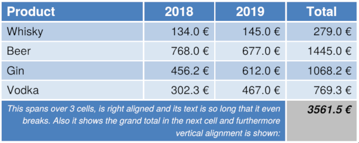
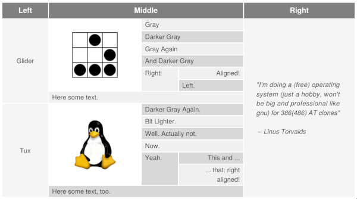
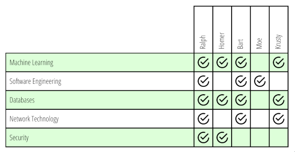
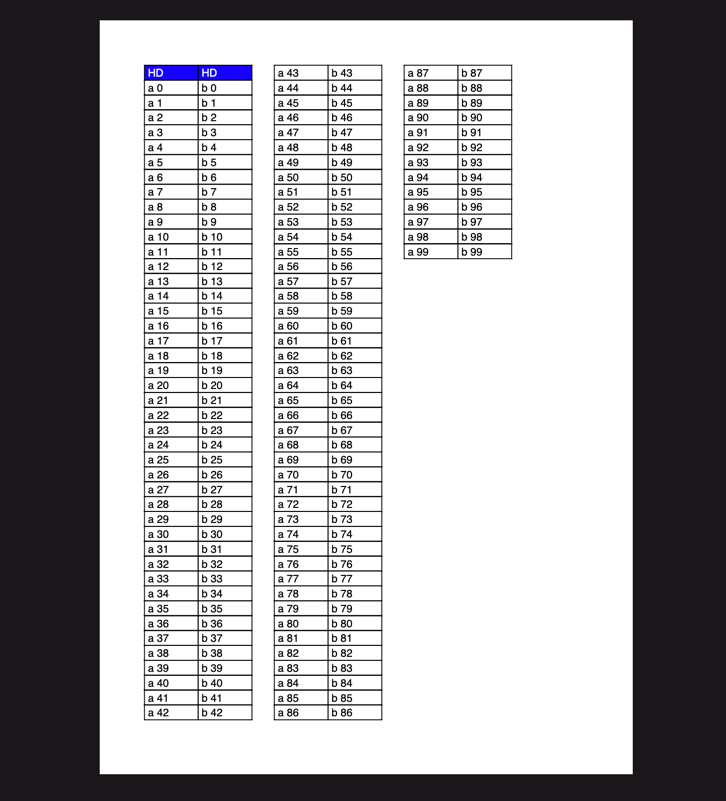
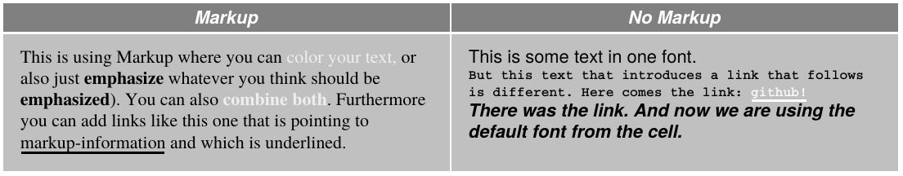

# easytable

This is a small project that builds upon
[Apache's PDFBox](http://pdfbox.apache.org) and should allow you
to create tables in a fairly simple way.
It emerged from the need in another project. Therefore, it also may miss some
crucial features. Nevertheless, there is:

* setting font and font size, table, row, column and cell level
* line breaking and line spacing
* background color and style on table, row, column and cell level
* padding (top, bottom, left, right) on table, row and cell level
* border color, width and style (on table, row or cell level)
* support for text alignment (right, left, center, justified)
* vertical text alignment (top, middle, bottom)
* column spanning and row spanning 
* images in cells
* allowing for a lot of customizations
* experimental: vertical text, [links, markup and paragraphs within cells](#paragraph-cells), drawing a large table's 
overflow on the same page

One can also override classes that are responsible for table/cell drawing, i.e. 
their drawing behaviour can be customized to a pretty high extent.

It is also possible to draw a table over multiple pages (even with the 
header row being repeated on every new page) or to draw a large table's overflow 
next to the already existing table on the same page (see below for examples).

## Installation

Add this to your `pom.xml`:

    <dependency>
        <groupId>com.github.vandeseer</groupId>
        <artifactId>easytable</artifactId>
        <version>0.8.5-SNAPSHOT</version>
    </dependency>

Or checkout the repository and install it locally with maven (e.g. for the`develop` branch):

    mvn clean install -DskipTests -Dgpg.skip -Ddependency-check.skip=true

## Examples

There is a [minimal full working example](src/test/java/org/vandeseer/MinimumWorkingExample.java) 
which should help you getting started.  

For a bit more involved tables have a look at [this code](src/test/java/org/vandeseer/integrationtest/ExcelLikeExampleTest.java) 
which is needed for creating a PDF document with the following two tables:

For the next example have a look at the [SettingsTest.java](src/test/java/org/vandeseer/integrationtest/settings/SettingsTest.java):

The last one illustrates the use of vertical text in text cells. The code for 
it can be found [here](src/test/java/org/vandeseer/integrationtest/VerticalTextCellTest.java):

Drawing the overflow of a large table on the same page is also [possible](src/test/java/org/vandeseer/integrationtest/OverflowOnSamePageTableDrawerTest.java): 

If you run the tests with `mvn clean test` there also some PDF documents created which you can find in the `target` folder.
The corresponding sources (in order to understand how to use the code) can be found in the test package.

## Paragraph Cells

Since several people asked me to include a way to add hyperlinks within cells I did a bit of research
and stumbled across a really nice library named [pdfbox-layout](https://github.com/ralfstuckert/pdfbox-layout). 
Unfortunately that library will not be developed 
any further, but it still provides a very powerful API for creating paragraphs with "styled text" (including links
as well as markup). 

Therefore I created a wrapper cell type (named `ParagraphCell`) which allows to append
- hyperlinks
- styled text (i.e. colorable text with a font and font size) as well as
- markup (please see this [documentation](https://github.com/ralfstuckert/pdfbox-layout/wiki/Markup)).

Note that the easytable API may be a bit different to what you find in the linked documentation.
Anyway, in order to get your hands dirty look at [this code](src/test/java/org/vandeseer/integrationtest/ParagraphCellTest.java) 
on how to create such a table: 

### Adding Needed Dependency

This is still a bit experimental and there may be changes in the future. 
If you want to use this feature nevertheless you need to add pdfbox-layout as a dependency. 
In case you are using maven for instance in your `pom.xml`:

    <repositories>
        <repository>
            <id>jitpack.io</id>
            <url>https://jitpack.io</url>
        </repository>
    </repositories>
    ...
    <dependency>
        <groupId>com.github.ralfstuckert.pdfbox-layout</groupId>
        <artifactId>pdfbox2-layout</artifactId>
        <version>1.0.1</version>
        <exclusions>
            <exclusion>
                <groupId>org.apache.pdfbox</groupId>
                <artifactId>pdfbox</artifactId>
            </exclusion>
        </exclusions>
    </dependency>

### Setting the Page on `TableDrawer`

Please note that you also need to set the `page(...)` on the `TableDrawer` in case you 
are using a `ParagraphCell`.

    TableDrawer.builder()
        .page(page) // <-- This is needed!
        .contentStream(contentStream)
        .table(table)
        ...
        .build()
        .draw()

## Kudos

*   to [Binghammer](https://github.com/Binghammer) for implementing cell coloring and text center alignment
*   to [Sebastian Göhring](https://github.com/TheSilentHorizon) for finding and fixing a bug (column spanning)
*   to [AndreKoepke](https://github.com/AndreKoepke) for the line breaking feature, some bigger nice refactorings and 
improvements
*   to [Wolfgang Apolinarski](https://github.com/wapolinar) for the printing over pages and bugfixes
*   to [AdrianMiska](https://github.com/AdrianMiska) for finding and fixing an issue with cell height
*   to [TheRealSourceSeeker](https://github.com/TheRealSourceSeeker) for finding a bug caused by using `float`s
*   to [Drummond Dawson](https://github.com/drumonii) for code changes that allowed removing a dependency
*   to [styssi](https://github.com/styssi) for allowing several multipage tables being drawn on the same page
*   to [Richard Mealing](https://github.com/mealingr) for adding the license section to the `pom.xml`
*   to [msww](https://github.com/msww) for finding a [small issue](https://github.com/vandeseer/easytable/issues/85)
*   to [VakhoQ](https://github.com/VakhoQ) for implementing border styles
*   to [Ralf Stuckert](https://github.com/ralfstuckert) for creating [pdfbox-layout](https://github.com/ralfstuckert/pdfbox-layout)
*   to [Miloš Čadek](https://github.com/c4da) for implementing alignment of vertical text cells

## Q&A

### Can I customize the drawers for my own specific needs?

Yep, you can customize the cell drawers itself or (depending on your use case)
you can just create a custom cell. 

For using a customized cell drawer, have a look at 
[CustomCellDrawerTest](src/test/java/org/vandeseer/integrationtest/custom/CustomCellDrawerTest.java).

In case you want to create your own type of cell (which shouldn't really be necessary since the 
drawing can be completely adapted) you will need to use [Lombok](https://projectlombok.org/)'s `@SuperBuilder`
annotation. Again, just have a look at the code: 
[CustomCellWithCustomDrawerUsingLombokTest](src/test/java/org/vandeseer/integrationtest/custom/CustomCellWithCustomDrawerUsingLombokTest.java)

### Can I draw a table over multiple pages?

Yes, have a look at [TableOverSeveralPagesTest.java](src/test/java/org/vandeseer/integrationtest/TableOverSeveralPagesTest.java).
Just use `startY(...)`  and `endY(..)` in order to restrict the vertical part of the page 
where the table should be drawn: 

    RepeatedHeaderTableDrawer.builder()
        .table(createTable())
        .startX(50)
        .startY(100F)
        .endY(50F) // <-- If the table is bigger, a new page is started
        .build()

### Is there a way to repeat the header on every page?

Depending on whether you want to repeat the header row or not you 
should use `RepeatedHeaderTableDrawer` or `TableDrawer` respectively.

### Can I get the `y` coordinate of the end of a drawn table?

Yes. Just use the `.getFinalY()` method. Also see [FinalYTest.java](src/test/java/org/vandeseer/integrationtest/FinalYTest.java).

### Cool, I like it, can I buy you a beer?

Yes. Or you can upvote this answer on [stackoverflow](https://stackoverflow.com/questions/28059563/how-to-create-table-using-apache-pdfbox/42612456#42612456). Or:

